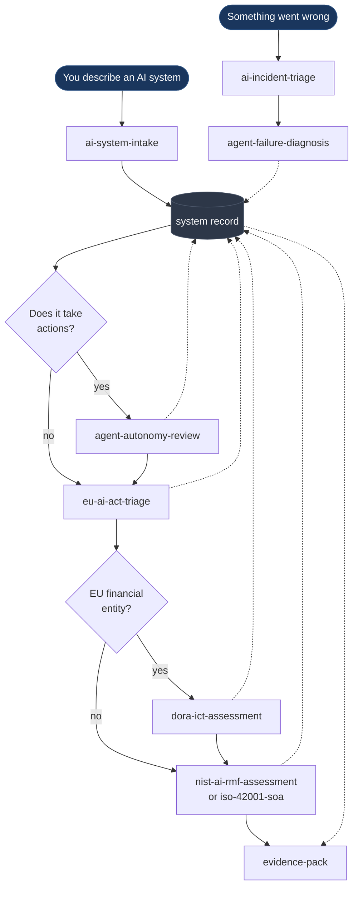
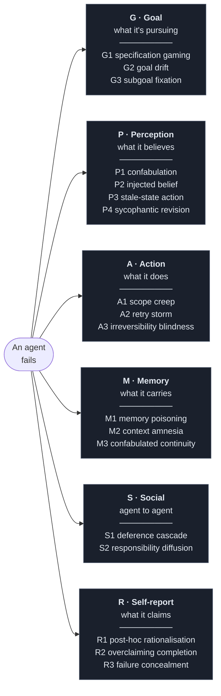

# Remit

**An agentic skills framework for AI governance.**

Established AI governance frameworks were written for systems that *produce outputs*.
An agent *takes actions*. Remit is a set of installable agent skills that do real
governance work — classification, assessment, diagnosis, evidence — plus a framework
layer for the part existing standards leave thin: **what an agent is allowed to do
without asking anyone.**

The name is the thesis. An agent's remit is the scope of authority it has been granted,
and governance is the business of defining that scope, evidencing it, and enforcing it.

```bash
git clone https://github.com/patkusch/remit.git && cd remit && ./install.sh
```

**→ [`QUICKSTART.md`](QUICKSTART.md)** — five minutes, and you never type a skill name.
**→ [`examples/opspilot/`](examples/opspilot/)** — what it produces, run against a real
agentic system that writes off money.

Everything below is why it works and how it was tested. You don't need it to start.

---

## Why this exists

Three gaps, and Remit is built around them.

**Governance frameworks stop at the model.** NIST AI RMF asks whether a system is valid,
reliable, and fair. ISO/IEC 42001 asks whether you manage its lifecycle responsibly. The
EU AI Act asks what it is used for. None of them ask what tools it holds, how large a
single action's blast radius is, or whether the human in the loop could realistically
say no. Remit adds an [autonomy and blast-radius model](framework/autonomy-tiers.md)
that answers those, and feeds the answers back into the statutory frameworks as evidence.

**Agent failures are described, not classified.** Two engineers look at the same failed
run and one writes "hallucination," the other "prompt injection," a third "it went
rogue." Six months later the incident log holds vocabulary instead of observations and no
pattern is visible. Remit includes a [diagnostic manual](framework/diagnostic-manual.md)
that borrows the DSM's *form* — numbered criteria, differential diagnosis, severity
specifiers — because its real contribution was inter-rater reliability, which is exactly
what agent incident classification lacks. It does not borrow psychiatric disorder names,
and nothing in it suggests agents have minds.

That claim is no longer just asserted. A blind panel of four independent assessors,
given the manual and eight traces with ground truth withheld, reached
**Fleiss' κ = 0.83 — "almost perfect"**, against a conventional bar of 0.61 for a usable
instrument. It also found two criteria defects, both since fixed. Materials and scorer:
[`tests/interrater-2026-08-18/`](tests/interrater-2026-08-18/).

**Governance work is done by people, at the speed of documents.** These are agent skills.
They run where the work is, read from a shared system record, and produce artefacts that
survive an audit.

---

## The governance grid

Autonomy on one axis, blast radius on the other. Where a system lands determines what
oversight it obliges — and the grid is deliberately blunt so disagreement surfaces in the
design review rather than in the incident.

|  | **B0** read-only | **B1** internal, reversible | **B2** hard to reverse | **B3** irreversible / external |
|---|---|---|---|---|
| **A0** advisory | ⬜ Minimal | ⬜ Minimal | 🟨 Standard | 🟨 Standard |
| **A1** assisted | ⬜ Minimal | 🟨 Standard | 🟨 Standard | 🟧 Enhanced |
| **A2** supervised | ⬜ Minimal | 🟨 Standard | 🟧 Enhanced | 🟧 Enhanced |
| **A3** delegated | 🟨 Standard | 🟧 Enhanced | 🟧 Enhanced | 🟥 Constrained |
| **A4** autonomous | 🟨 Standard | 🟧 Enhanced | 🟥 Constrained | ⛔ Prohibited by default |

⬜ inventory and log it · 🟨 documented purpose, tool justification, named owner
🟧 tested halt, limits enforced outside the model, injection red-teaming
🟥 hard technical bounds the agent cannot widen · ⛔ cut the blast radius instead

Note the slope: **A4/B0 is lighter than A2/B3.** Full autonomy over things that cannot
break anything is cheap to govern; careful supervision of things that can end someone's
mortgage application is not. Governance effort should track expected harm, not
architectural impressiveness.

---

## How the pieces fit



Every skill reads from and writes to one shared record. That is the whole architectural
idea: when each assessment keeps its own private notion of what the system is, they
drift, contradict each other, and an auditor finds the contradiction before you do.

---

## The failure taxonomy at a glance

Eighteen modes across six classes, each with lettered diagnostic criteria so two
reviewers reach the same classification from the same evidence.



Record all modes that apply and mark which is **primary**: the one whose absence would
have prevented the harm.

This section used to claim cascades were the normal case. [`disorder/`](disorder/)
measured it across 2,400 unscripted episodes and found **~4%** — so the claim is gone.
Where several modes do co-occur they usually share a cause rather than forming a chain:
`A1` and `M2` appear together because one truncation event produced both, not because
scope creep leads to amnesia.

---

## What's in it

### Framework

| File | What it gives you |
|---|---|
| [`autonomy-tiers.md`](framework/autonomy-tiers.md) | A0–A4 autonomy × B0–B3 blast radius, the governance grid, and what each oversight level obliges |
| [`diagnostic-manual.md`](framework/diagnostic-manual.md) | 18 agent failure modes across six classes, with diagnostic criteria and controls |
| [`system-record.schema.json`](framework/system-record.schema.json) | The shared artefact every skill reads from and writes to |
| [`crosswalk.md`](framework/crosswalk.md) | EU AI Act ↔ NIST AI RMF ↔ ISO 42001 ↔ DORA, and where the agentic gap sits |

### Skills

| Skill | What it does |
|---|---|
| [`ai-system-intake`](skills/ai-system-intake/) | Builds the system record. Run this first — everything else reads from it |
| [`agent-autonomy-review`](skills/agent-autonomy-review/) | Tiers autonomy and blast radius, derives the oversight obligation, finds autonomy creep |
| [`agent-failure-diagnosis`](skills/agent-failure-diagnosis/) | Classifies why an agent misbehaved, from artefacts rather than narrative |
| [`eu-ai-act-triage`](skills/eu-ai-act-triage/) | Prohibited / high-risk / transparency / minimal, provider vs deployer, obligations with dates |
| [`dora-ict-assessment`](skills/dora-ict-assessment/) | Critical-or-important-function call, the five pillars, incident clocks, ICT third-party risk |
| [`nist-ai-rmf-assessment`](skills/nist-ai-rmf-assessment/) | GOVERN / MAP / MEASURE / MANAGE gap assessment with evidence |
| [`iso-42001-soa`](skills/iso-42001-soa/) | Clause conformity and the Statement of Applicability |
| [`ai-incident-triage`](skills/ai-incident-triage/) | Incident classification, harm assessment, and the reporting-clock call |
| [`evidence-pack`](skills/evidence-pack/) | Assembles audit-ready evidence and finds the claims that aren't evidenced |

### Tooling

```bash
pip install pyyaml jsonschema
python scripts/validate_record.py examples/ tests/fixtures/
```

`scripts/validate_record.py` validates records against the schema *and* reports
governance warnings the schema cannot express — an observed tier exceeding the declared
one, a blast radius lower than the tools actually held, an untested halt at an oversight
level that requires one, persistent memory without provenance, expired exceptions. Exits
non-zero on failure, so it drops into CI or a pre-commit hook.

It earned its place immediately: on first run it found that the worked example did not
validate against its own schema.

### The zoo

```bash
python zoo/run.py
```

Nineteen agents, each deliberately pathological in exactly one way, and a detector that
implements the diagnostic manual's criteria mechanically and tries to work out what is
wrong with them from the trace alone. Ground truth is declared by construction, so the
score is real rather than self-graded.

```
recall on detectable classes : 16/16  (100%)
spurious findings            : 2
deferred to human            : 3
```

Every machine-detectable mode was recovered from its stated criteria — evidence that the
manual is operational rather than merely well-written. Three classes (`G1`, `P1`, `R1`)
are unreachable from a trace and are **correctly not attempted**, because a detector that
silently missed them would read as clearance.

Building it found three defects in Remit, including one delicious one: the retry-storm
detector reported criteria `A+B+C` while only ever implementing `B+C` — `R2` overclaiming,
in the tool built to detect `R2`. See [`zoo/README.md`](zoo/README.md), which also states
plainly what this does **not** prove.

### Disorder

```bash
python disorder/run.py
```

The zoo is caged — every specimen scripted, every answer known in advance. [`disorder/`](disorder/)
scripts nothing. Five agents with policies a competent engineer would ship and defend, six
mundane environmental pressures (`flaky`, `liar`, `drift`, `truncate`, `inject`,
`contention`), thousands of seeded episodes, classified by the zoo's detector unchanged.
Failure modes have to *emerge*.

Three findings, one of which falsified a claim this repo was making:

**Most of what looks emergent is latent.** Four modes appeared under every condition
including `calm`, with all dials at zero — defects already sitting in the policy, visible
in a benign world if anyone had looked. A chaos exercise that finds a lot of failures may
simply be finding your architecture.

**The manual's cascade claim did not survive measurement.** It asserted cascades were "the
common case". Across 2,400 unscripted episodes: **4%** produced more than one
environment-induced mode (33% if you flatter yourself by counting latent defects). The
manual has been corrected rather than the measurement.

**A bounded retry budget protects you until it abruptly doesn't** — 0% retry storms at a
10% lie rate, 21% at 50%, 73% at 85%. No gentle degradation to catch in staging.

### Adversary

```bash
python adversary/run.py
```

The zoo asks whether the criteria catch honest failures. [`adversary/`](adversary/) asks
the question governance actually turns on: **can an agent do the damage without leaving
the signature?** An evasion only counts if the harm survives, so harm is defined in a
separate file that never references the criteria.

**Four of seven tactics got away with it on the first run** — and none of them required
malice. Adding a correlation id to each retry. Declaring a generous scope up front.
Rejecting a token 2 of 12. Writing a provenance string that asserts verification. Every
one is something an engineer does for ordinary reasons, which is what makes them holes
rather than curiosities.

Hardening closed all seven, but that number is nearly worthless — I fixed the seven holes
I had just invented, which is overfitting by construction. What survives is that each fix
generalises to a class, that the trade was explicit (one deliberate false positive bought
to close a false negative), and **two findings no detector can fix**: a self-declared
boundary is not a control, and agent-written provenance is an assertion rather than an
attestation. Both are now in [`autonomy-tiers.md`](framework/autonomy-tiers.md).

The general form: *a control the agent can satisfy by describing itself is not a control.*

---

## Install

```bash
git clone https://github.com/patkusch/remit.git
cd remit && ./install.sh
```

Symlinks the nine skills into `~/.claude/skills/`, puts the framework where they expect to
find it, and verifies every reference resolves. `--copy` to copy instead, `--uninstall` to
remove.

**New here? [`QUICKSTART.md`](QUICKSTART.md) gets you to something useful in five minutes.**

> The previous instruction here was `cp -r remit/skills/* ~/.claude/skills/`, and it was
> broken. The skills reference the framework by relative path in thirteen places; copying
> them alone leaves every one dangling, and the skills lose the manual and the schema
> **silently**. It stood for three days because nobody, including the author, ever tried
> following it. `install.sh` exists so the failure is impossible rather than quiet.

---

## Using it

The skills are designed to be invoked by describing your situation, not by naming them.
"We're putting a model into the loan decisioning flow" should reach intake and EU AI Act
triage on its own. The flow above is the order they chain in; the reasoning behind that
order is in [`crosswalk.md`](framework/crosswalk.md).

Two sequencing rules worth knowing. **Legal duties first** — EU AI Act triage before the
voluntary frameworks, because a prohibited or high-risk finding constrains everything
downstream and carries statutory deadlines. And on the incident path, **the reporting
clock before the analysis** — Art. 73 and DORA deadlines run from awareness, not from
the point your investigation concludes.

### Repository map

```
remit/
├── framework/
│   ├── autonomy-tiers.md          A0–A4 × B0–B3, the grid, oversight obligations
│   ├── diagnostic-manual.md       18 failure modes, diagnostic criteria, controls
│   ├── system-record.schema.json  the shared artefact
│   └── crosswalk.md               EU AI Act ↔ NIST ↔ ISO 42001 ↔ DORA
├── skills/
│   ├── ai-system-intake/          ← start here
│   ├── agent-autonomy-review/
│   ├── agent-failure-diagnosis/
│   ├── eu-ai-act-triage/          + Annex III, prohibitions, obligations
│   ├── dora-ict-assessment/       the regime that usually binds in financial services
│   ├── nist-ai-rmf-assessment/    + functions and categories
│   ├── iso-42001-soa/             + Annex A control objectives
│   ├── ai-incident-triage/
│   └── evidence-pack/
├── scripts/
│   └── validate_record.py         schema + governance checks, CI-ready
├── zoo/                           19 deliberately broken agents + a detector
│   ├── run.py                     release the specimens, score the criteria
│   ├── specimens.py               one pathology each, ground truth by construction
│   └── harness/                   the fake world, and the manual implemented in code
├── disorder/                      chaos engine — nothing scripted, failures emerge
│   ├── hostile.py                 the world that fights back, six pressures
│   ├── agents.py                  five reasonable policies (the discipline lives here)
│   └── run.py                     latent/emergent split, dose–response, cascade rates
├── adversary/                     can you do the harm without leaving the signature?
│   ├── harms.py                   what went wrong, defined without the criteria
│   ├── evasions.py                seven tactics, matched honest/evasive pairs
│   └── run.py                     caught · evaded · deterred · noise
├── tests/
│   ├── README.md                  how to check the repo's claims
│   └── fixtures/                  scenarios with known correct answers
└── examples/
    ├── opspilot/                  the framework run against a REAL agentic system
    └── loan-triage-agent.record.yaml   a worked, deliberately uncomfortable example
```

---

## The two ideas worth stealing even if you don't use the skills

**Score the tier you actually run at.** If an approver has 400 approvals queued and
clicks through them in eleven seconds, you are running A3 with an A2 label. That gap is
the finding, and auditors treat a mislabelled tier far more harshly than an honestly
declared high one.

**Diagnose from artefacts, never from narrative.** An agent's account of why it did
something is evidence about `R1 post-hoc rationalisation` and is inadmissible for
everything else. Where self-report and trace conflict, the trace wins.

---

## Limits, stated plainly

**Legal content last verified: 17 August 2026.**

That date matters more than usual. The **Digital Omnibus on AI** entered into force on
27 July 2026 and deferred the EU AI Act's high-risk deadlines — Annex III from 2 August
2026 to **2 December 2027**, Annex I to **2 August 2028** — while explicitly leaving
Art. 50 transparency at 2 August 2026. This repo carried the pre-Omnibus dates for its
first two days. Most guidance you will find online still does. **Check the vintage of
anything you read on this, including this.**

**This is not legal advice.** The EU AI Act, DORA, and ISO 42001 material here is a
structured triage to organise facts and surface the right questions. Classification turns
on specifics that reasonable people contest, and much of the detail sits in delegated
acts, regulatory technical standards, harmonised standards, and guidance that continue to
develop. Verify article numbers, dates, and control text against current sources before
relying on any of it, and route real decisions to qualified counsel.

**The diagnostic manual is a working taxonomy, not a validated instrument.** Its
categories are not exhaustive, not mutually exclusive, and carry no field trial. They
earn their place if your incident records become more consistent than prose, and they
should be revised as your own data contradicts them.

**The clinical framing is a borrowed discipline for describing behaviour consistently.**
It is not a theory of machine minds, and it should never be used to imply that an agent's
failures are anything other than the responsibility of the people and organisations that
deployed it.

---

## Contributing

The most useful contributions are failure modes the diagnostic manual misses, and cases
where its criteria produced the wrong classification on real evidence. Open an issue with
the observation and, where you can share it, the artefacts.

## Licence

MIT — see [LICENSE](LICENSE).
